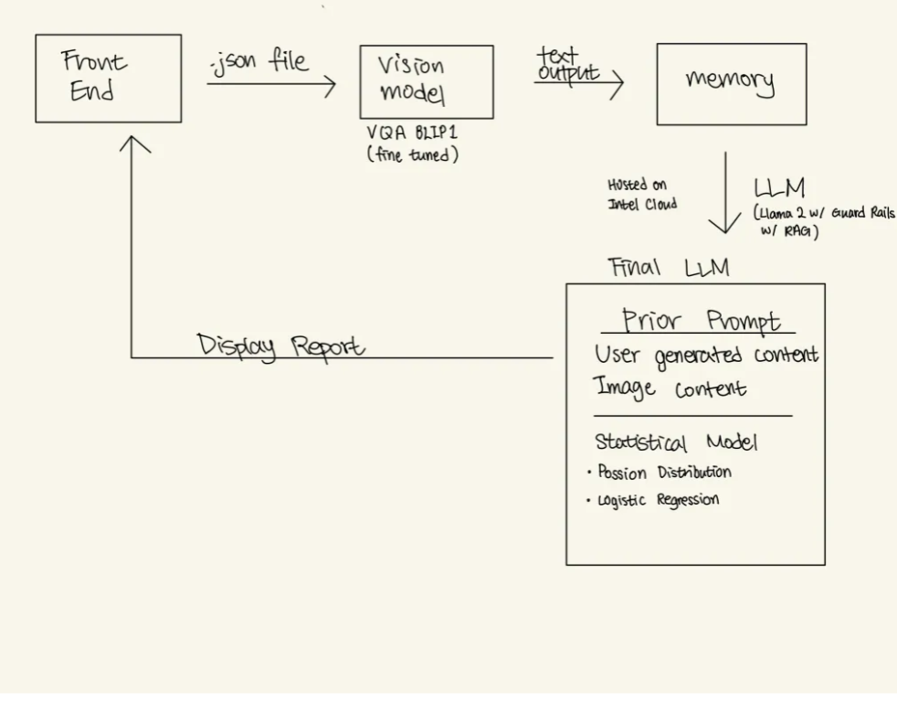

Team donutStealers' (Kshitij Duraphe, Shaunak Halbe, Rong Li, Minyoung Park) project at [Hacklytics 2024](https://hacklytics.io). We implemented an end-to-end system leveraging **Visual Questioning Answering** (VQA) models (specifically, the BLIP family of models) and the Llama-2 Large Language Model in order to design a system where a user can take a photo of an arbitrary property and the system estimates its health and generates key insights by combining the observations from the VQA model and user-provided complaints.

Here is a diagram of our workflow:

The full report can be found [here](Insurance survAIyor donutStealers.pdf).
